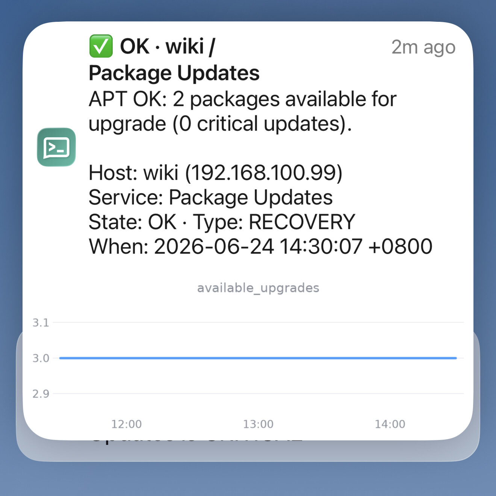

# ntfy-icinga-rich-alerts

Rich, self-hosted push notifications for [Icinga 2](https://icinga.com/) via
[ntfy](https://ntfy.sh/) — with a lock-screen performance graph, **Acknowledge / Downtime**
action buttons, and HA-safe deduplication. No SaaS, no per-seat pricing, you own the data.

<p align="center">
  
  <br><em>A notification on the lock screen — state, check output, host, and an inline perfdata graph.</em>
</p>

## Why

Most "real" alerting that reaches a phone routes through a third-party SaaS. This project gives
you the same glanceable, actionable experience on infrastructure you run yourself:

- **Self-hosted, no SaaS** — your own ntfy server; alerts and acknowledgements never leave your
  control. (iOS instant-push optionally piggybacks the public ntfy.sh APNs relay, which only ever
  sees a wake-up hash of the topic, not your message.)
- **Rich push** — the notification carries a **performance graph** rendered for the failing
  metric, **Acknowledge** and **Downtime 1h** buttons that act on Icinga right from the lock
  screen, and a deep link straight into Icinga Web.
- **HA-safe dedup** — a fixed-cooldown suppression model keyed per `host!service`, optionally
  shared across multiple Icinga masters via Redis, so an HA pair doesn't double-alert.

## Features

- One notification per problem, then quiet for a configurable cooldown — with **severity
  break-through** (e.g. `WARNING -> CRITICAL`, or a fresh problem after recovery) sending one
  extra alert.
- **State → priority mapping** (`CRITICAL/DOWN -> urgent`, `WARNING -> high`, …) so severe
  problems break through Do-Not-Disturb.
- **Transparent single-metric graph** that blends into the phone's light/dark theme, large fonts
  for a small screen, and a **negative-axis flip** so an all-negative metric (e.g. a −48 V
  battery) reads as a *down* trend when its magnitude drops.
- **Acknowledge / Downtime buttons** (HMAC-signed) that act on the Icinga API behind a **scoped**
  API user — the Icinga credentials never touch the phone.
- **Nothing exposed inbound.** The buttons publish to an ntfy *ack topic* that a small local
  subscriber (`relay.py`) watches **outbound** — so they work behind CGNAT or against ntfy.sh with
  no inbound port-forward or tunnel.
- **IcingaDB Web deep link** ("Open in Icinga") on every alert.
- **Two graph backends:** render a parametric **Grafana** panel, or draw a compact **matplotlib**
  sparkline straight from **VictoriaMetrics** (Grafana-free).
- **Fails open and degrades gracefully:** if the graph, image upload, or suppression store fail,
  the alert still goes out (text-only if needed) — a missed alert is worse than a duplicate.

## Architecture

```
            Icinga master                                  phone (ntfy app)
   ┌────────────────────────────┐                        ┌──────────────────┐
   │  NotificationCommand        │   publish (+ graph)    │  subscribed to   │
   │    └─ dispatcher (notify.py)├───────────────────────►│  topic "alerts"  │
   │                             │     ntfy (behind       │  (push + buttons)│
   │       relay.py  ◄───────────┤◄─── Apache, on master)─┤                  │
   │         │ subscribes        │   push / live stream   └────────┬─────────┘
   │         │ outbound to       │                                 │ taps
   │         │ ack topic         │   publish signed action         │ Ack / Downtime
   │         ▼                   │◄────────── ntfy ack topic ◄──────┘
   │   local Icinga API          │
   │   (scoped ApiUser)          │
   └────────────────────────────┘

  graph data source (pick one): Grafana render API  OR  VictoriaMetrics query API
  TLS for ntfy is terminated by the master's existing Apache (server/apache.example.conf).
```

- **dispatcher** (`dispatcher/notify.py`) — Python, runs *on the Icinga master*, invoked by Icinga
  as a `NotificationCommand`. Applies suppression, renders the graph, publishes the ntfy message
  (graph uploaded into ntfy).
- **relay** (`dispatcher/relay.py`) — a small native service next to the dispatcher. Subscribes
  outbound to an ntfy ack topic and applies the Acknowledge/Downtime actions to the local Icinga
  API via a scoped ApiUser.
- **ntfy** — self-hosted natively (`apt install ntfy`, no containers) on the same master, behind the
  Apache that already serves Icinga Web (`server/apache.example.conf` terminates TLS so phones can
  reach it).

## Quick start

A native, no-containers install on a single Debian/Ubuntu Icinga host:

1. Install ntfy (`apt install ntfy`) and put it behind your existing Apache (TLS).
2. Install the dispatcher (`sudo dispatcher/install.sh`), fill in `config.yml`, wire the Icinga
   notification + a scoped `ntfy-relay` ApiUser.
3. Run `relay.py` (systemd), subscribe a phone to the alert topic, and test.

Full copy-paste walkthrough: **[docs/install.md](docs/install.md)**. The data flow is in
**[docs/architecture.md](docs/architecture.md)**.

> **Prefer zero self-hosting?** Point `ntfy.base_url` at `https://ntfy.sh` and skip the ntfy +
> Apache steps — but free ntfy.sh topics are public, so use unguessable topic names.

## Configuration

All dispatcher behaviour lives in `config.yml` (copy from `dispatcher/config.example.yml`). Any
`${ENV_VAR}` reference is expanded at load time, so secrets can stay in the environment.

| Section | Key | What it does |
|---|---|---|
| `ntfy` | `base_url` / `token` | your ntfy server + a write token for the topic(s) |
| `icinga` | `web_url` | base URL for the "Open in Icinga" deep link |
| `actions` | `shared_secret` / `ack_topic` | HMAC secret signing every action + the ntfy ack topic the buttons publish to |
| `relay` | `ack_read_token` / `icinga_api_*` | the relay's ntfy read token + scoped local Icinga API endpoint |
| `render` | `backend` | `grafana` (render a panel) or `vm` (matplotlib sparkline from VictoriaMetrics) |
| `suppression` | `store` | `sqlite` (single master) or `redis` (HA / shared across masters) |
| `routing` | `priority_map` | state → ntfy priority (`min|low|default|high|urgent`) |
| `display` | `strip_domains` | domain suffixes stripped from host names *in the title/body only* |

### How suppression works

Keyed per `host!service`:

- Notification types in `always_notify_types` (recovery, ack, downtime, …) **always** pass.
- The **first** time a key is ever seen → send.
- A jump to a **higher severity** (an escalation — including recovery → problem, or
  `WARNING -> CRITICAL`) **breaks through** the cooldown and sends one alert.
- A repeat **PROBLEM of the same state** is **suppressed** until the per-state cooldown elapses,
  then one reminder is sent and the timer resets.

The state store is pluggable: **SQLite** for a single master (no extra service), or **Redis**
shared across an HA pair so flapping between masters dedups. Suppression **fails open** — if the
store is unreachable the alert is sent anyway.

## Security

- **HMAC-signed actions.** Each Ack/Downtime button carries a short HMAC token over
  `action:host:service` (signed with `actions.shared_secret`), verified by `relay.py` before it
  calls Icinga. The phone never holds Icinga credentials.
- **Scoped ApiUser.** The Icinga API is reached through a dedicated ApiUser limited to
  `acknowledge-problem` + `schedule-downtime`.
- **Self-hosted, all outbound.** Alerts, acknowledgements, and the graph stay on infrastructure
  you control. The dispatcher and relay only make outbound connections; the only optional third
  party is the public ntfy.sh APNs relay used for iOS instant push, which only ever receives a
  SHA-256 wake-up of the topic name — never your message.
- Keep `config.yml` and `server.yml` out of version control (the included `.gitignore` already
  does this) — only the `*.example.*` templates are tracked.

## Requirements

- A **Debian/Ubuntu** host running **Icinga 2** with the API feature enabled
  (`icinga2 feature enable api`), already serving Icinga Web behind **Apache2**.
- **Python 3.9+** on the Icinga master (the installer builds an isolated venv). The `vm` render
  backend additionally needs `matplotlib` + `numpy` (installed automatically).
- A self-hosted **ntfy** server (`apt install ntfy`, native — no containers) behind that **Apache** for
  TLS. (Or point at the public **ntfy.sh** and skip self-hosting.)
- A graph data source: a **Grafana** instance with a parametric panel, *or* **VictoriaMetrics**
  (or any Prometheus-compatible API) holding your Icinga perfdata.
- The **ntfy** app on the devices you want to alert.

## License

MIT — see [LICENSE](LICENSE). Copyright (c) 2026 Daniel Hooper.
